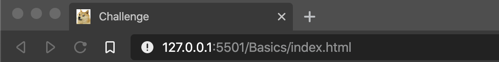
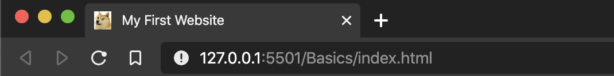

# WDD01 Day in the life

Beginner and intermediate client-side development challenges.

## Morning Meeting

We'll go through
- basics of what is involved when you visit a webpage
- tools we & the whole industry use
- the basics of HTML and CSS

Slideshow: https://docs.google.com/presentation/d/13uqWRk190Ergdy61iCDBQ9guoCJkbSnT_aH2gZeBkQY/edit#slide=id.g64bc3b77e4_0_109

### Video - HTML, CSS and JavaScript: The Big Picture

We'll watch a succinct video together on `HTML, CSS and JavaScript: The Big Picture` to get an overview understanding of the core parts of the web - from https://app.pluralsight.com/library/courses/html-css-javascript-big-picture/table-of-contents

 * Course Overview
 * Why You Should Care About How the Web Works
 * Displaying the Web with HTML

### Challenge Brief

Today we'll be diving into HTML documents and CSS styling basics,
then create a chatbot.

## Resources / Self-directed learning

HTML elements, tags, and attributes are the fundamental blocks for building web pages. This section will cover the basics of HTML so you can write your first webpage.

W3C HTML elements tutorial: https://www.w3schools.com/html/html_elements.asp

Need some colour ideas? Check out https://coolors.co/ or http://colormind.io/

## Challenge Part A - Basics of HTML & CSS

For this challenge section, you will need to use the starter website that's been set up in the `Basics` folder.

1. Open up vscode and open the `WDD01 Day in the life` workspace from the Recent section.

2. See the files panel on the left - double-click the `Basics/index.html` file - this is where your HTML will go.

3. Right-click on `Basics/index.html` and select `Open with Live Server`:

   - Now the HTML document can be edited in `Basics/index.html`, saved & the page content will re-load.

   - The CSS styles can be edited in `Basics/static/css/style.css`, saved & the page styles will re-load.

   - Now we're ready to go!

4. Update the `<title>` on line number 7:

    - Select the `Challenge` text in in between the `<title>` tags.

    - Change the text to `My First Website`.

    - Save the changes in the `index.html` document. You should see the webpage update the title text in the web browser tab.

    - 

    - 

5. Update the `<h1>` heading with the text `Hello, World!`:

    - Select the `Basics` text in between the `<h1>` and `</h1>` tags on line 17.

    - Change the text to `Hello, World!`.

    - Remember to save the file after making code updates to see the changes in the web browser.

6. Add some styling to the heading by adding a CSS style class to the heading element:

    - In the `<h1>` `class` attribute, put `main-heading` between the quotes.

     - The heading should now be larger and brighter!

7. Give the website a background image.

    - In the `style.css` stylesheet, find the `.background` style rule.

    - Paste the following between the parenthesis:

        ```
        background-image: url('/Basics/static/img/background.jpg');
        background-repeat: no-repeat;
        background-size: cover;
        ```

    - If all goes well, you should have a "dark themed" website now.

8. Back in the website `index.html` file, add a paragraph element under the heading.

    - Below the `main-heading` element, add a paragraph element `<p>  </p>`

    - Add some text to between the `<p>` tags. Just make up a story about the background image.

9.  Style the paragraph `<p>` element.

    - Add a `class` attribute to the `<p>` element.

    - Give the `class` attribute a value of `main-paragraph`.

    - In the `style.css` file add a new style rule called `.main-paragraph`.

    - In the `.main-paragraph` style rule add a `color:` property. Try using different colours names (or hex values). *Note: the CSS property must be spelt `color`.*

10. Be amazed at your glorious website!

## Challenge Part B - Chatbot 🤖

For this challenge section, you will need to use the starter website that's been set up in the `/Chatbot` folder.

Your code will need to go in the `Chatbot/static/js/chatbot.js` file.

### Beginner students

Your chatbot has been loaded with some of our logic to handle the reply logic, so you can focus on styling the chatbot 🤖

### Intermediate students

In Part B you'll be writing some logic for a chatbot 🤖 to reply to user input. You may skip or leave the  styling until last and focus on the chatbot reply logic.

1. In `chatbot.js` there are functions already written to handle the form submit and render the chat to the page. You need to write the code to attach the form submit handler to the form element.
    * Add the code for this at the bottom of the page.
    * Check the form `id` in the `index.html` file. There should be only one form in the document.
    * First you'll need to get a reference to the form element, then use the `.addEventListener` method to set the 'submit' event.

    If you've attached the submit handler correctly, you should be able to chat with the bot!

    You should also notice that the bot doesn't reply properly. You will need to implement the chat logic in the `botReply` function.

2. Find the `botReply` function in `chatbot.js`. You'll see it takes in a single parameter `msg`. That value will be the last input the user typed in. In the `botReply` function add an empty variable named `reply`.
3. Currently `botReply` always returns the string 'Error unknown ...' regardless of the user input. Update the `return` statement to return the `reply` variable.
4. Write the `botReply` logic to take the `msg` parameter and set the value of the `reply` variable based on something the user entered. It's up to you how to implement it, and what text to use for the replies.
    * You could use if/else or switch statements or a combination of the two.
    * You could just return a random string every time.
    * The function should be able to return at least three different replies.
    * You will need to use your `string-method-fu` here!

You can update the rest of the page and CSS as you see fit. Just make sure to keep any existing elements and element attributes (for testing purposes ...).

